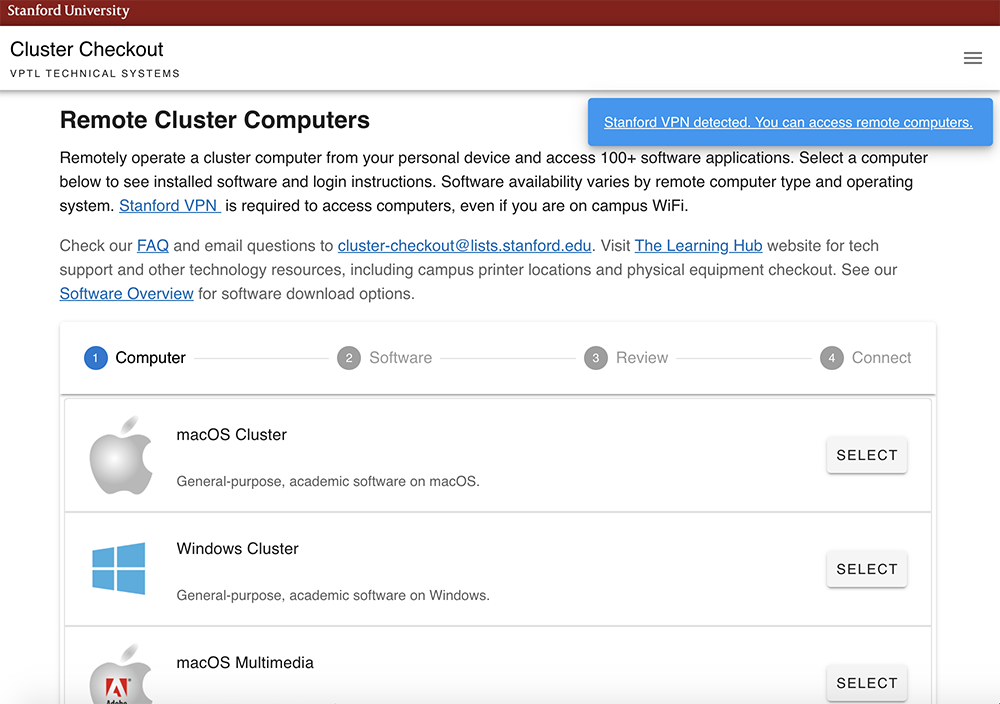

# Using ABBYY FineReader on Stanford's virtual workstations

Stanford's VPTL group has you covered even when you can't be on campus... like during a global pandemic, for instance. You can log into one of their virtual workstations, which work just as if you were in the Lathrop Computer Lab, or any other general-use computer lab on campus.

## Moving your data
Before you get started, you'll need to put your images in a place that you can access from the virtual machine. 

### Cloud storage
The easiest way to do it is to use your favorite cloud storage service (e.g. Google Drive, where you have unlimited storage if you use your Stanford credentials), then open a browser when you launch the virtual machine, download the files from cloud storage, and OCR them.

### AFS
Another option is putting files directly on AFS (Andrew File System), which is university storage associated with your SUNet. AFS is automatically connected to the virtual machine you log into, so you could OCR your image files directly from AFS storage, and then save the output text files back to AFS, which you can access from your laptop. For more information about AFS, you can [read the documentation and guides from University IT](https://uit.stanford.edu/service/afs).

## Microsoft Remote Desktop
Microsoft Remote Desktop is the software you'll need to connect to the virtual machine. Google "Microsoft Remote Desktop" and your operating system to download your software.

## VPN
First, you'll need to connect to the Stanford VPN. If it's the first time you're doing it, you'll need to install and configure it. You can find all the information you need about how to use the Stanford VPN on the [university IT guide to the VPN](https://uit.stanford.edu/service/vpn).

## Connecting to a virtual machine
After connecting to the VPN (as described above), head over to [https://cluster-checkout.stanford.edu/](https://cluster-checkout.stanford.edu/) and log in with your Stanford credentials. If you're not actually connected to the VPN, you'll see a warning message until your VPN is working correctly.

From the "Remote Cluster Computers" screen, choose the "Windows Cluster".

On the next page, which lists software on the different images, click "Next".

Hit "Next" again on the page with the "important details".

Click on the shortcut to the machine (indicated by the arrow). This will download the shortcut, which you can then launch using Microsoft Remote Desktop. (Make sure that it doesn't accidentally launch using different software.) Log in, and a window will launch with the virtual machine.

## Downloading your images
If you used cloud storage for your files, first open a web browser, log into your cloud storage, and download your images to the virtual machine.

## ABBYY FineReader
You'll find ABBYY FineReader listed with the software on the virtual machine. After you launch it, you can follow the instructions in this <a href="https://guides.nyu.edu/abbyy">wonderfully detailed ABBYY FineReader tutorial from NYU Libraries</a>. Save your plain text (.txt) output back to AFS or cloud storage.