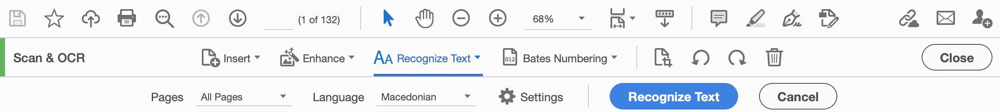

# Using Adobe Acrobat to do OCR

**Note:** Adobe Acrobat OCR is available for the following languages:

* Basque
* Brazilian Portuguese
* Bulgarian
* Chinese (Simplified)
* Chinese (Traditional)
* Croatian
* Czech
* Danish
* Dutch
* English (US/UK)
* Estonian
* Finnish
* French
* Galician
* German
* Greek
* Hebrew
* Hungarian
* Italian
* Japanese
* Korean
* Latvian
* Lithuanian
* Macedonian
* Maltese
* Norwegian
* Nynorsk
* Occitan
* Polish
* Portuguese
* Romanian
* Russian
* Serbian
* Slovak
* Slovenian
* Spanish
* Swedish
* Swiss German
* Turkish
* Ukrainian

## Open your PDF
To use Adobe Acrobat Pro for OCR, first open the PDF with the scanned text in Acrobat. (If you just have image files for your scans, you can use Adobe Acrobat to create a PDF out of all the image files by going to File --> Create --> Combine Files Into a Single PDF.)

## Opening the OCR tool
Once your PDF file is open, go to *View --> Tools --> Scan & OCR --> Open*. This will open a new horizontal toolbar at the top of the interface.

## Selecting language and running OCR
Choose *Recognize Text --> In this file*. A secondary menu will appear with the language drop-down and a big blue *Recognize Text* button.

Choose your language, and press the *Recognize Text* button. The OCR process will take some time.

## Saving the output
Once the OCR is done, you should be able to highlight the text in the PDF. It may not look like you can highlight all the text (see below), but that doesn't necessarily mean there was a problem with the OCR.

You should be able to copy text from the PDF and paste it outside of Adobe Acrobat. But a more efficient way to get the text out is by going to *File --> Export to --> Text (Plain)*