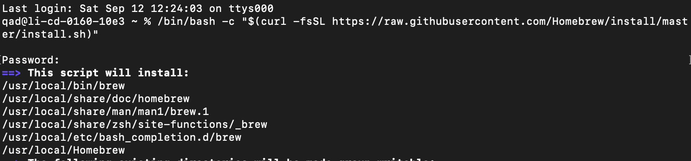
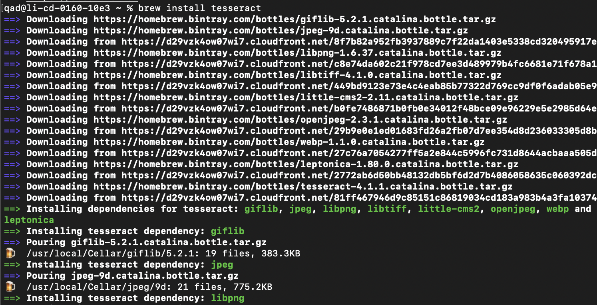
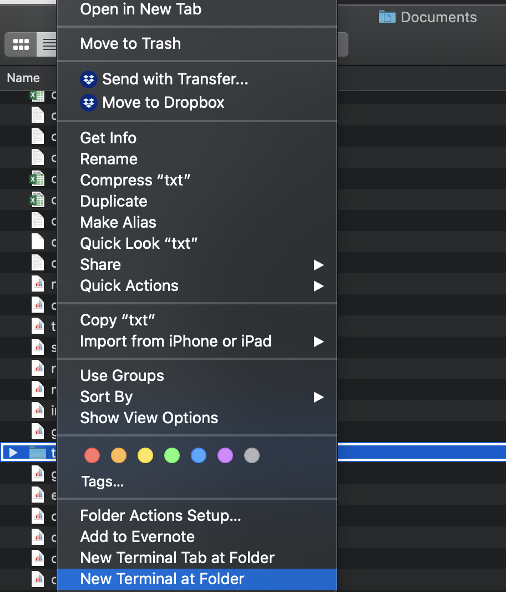

# Installing and Running Tesseract OCR
Tesseract is free, open-source OCR software with support for many, many different languages and writing systems. It works on Windows, Mac, and Linux.

Sounds great, right?

The downside is that it's not as good as some of the other software (especially ABBYY FineReader) for layout detection, or recognizing images that it shouldn't try to OCR. It also doesn't reflow your text: you get the output exactly like you see it on the source image, compete with the lines as they appear on the original image.

It's also a command-line tool, which is good for giving you practice using the command line, but it's less familiar for most people.

Let's start with how to intall Tesseract and Ghostscript on a Mac, then on Windows. The instructions fo how to run it once it's installed are at the bottom.

## Installing Tesseract on a Mac
The first step is to install something that will let you install more things. I'm not joking.

### Open a terminal
Open *Applications* in Finder, and open the *Utilities* folder. Start *Terminal*, which will open a black window with a command-line prompt. You'll need to use Terminal to run Tesseract, too, so it's worth remembering where to find it.

### Install Homebrew
[Homebrew](https://brew.sh/) is a "package manager", a way to install certain kinds of software from the command line. It does useful things like install other required (dependency) software as part of the process of installing the software you request. (It also uses its own cutesy beer-themed jargon like "Cellar" and "Taps" and "Pouring" that you can mostly ignore.)

The Homebrew homepage has the line of code that you can paste into Terminal and run (by hitting the return key), in order to install Homebrew. Hit enter as many times as needed to continue with various steps (including installing XCode Command Line Tools).

### Installing Tesseract
Once Homebrew is installed, in your Terminal, copy and paste this line and run it: `brew install tesseract`

Homebrew will do its thing and run through the process of installing Tesseract. But that's not all! By default, Tesseract installs only the English language data. (I know, you're probably not shocked.) But we need the rest of the language data. Once the Tesseract install is done, run this command in your Terminal: `brew install tesseract-lang`.

If the images you want to OCR are saved as individual image files, you can proceed to running Tesseract, below. If you have PDFs that you want to OCR, you'll also need Imagemagick to convert your PDFs into individual image files.

### Installing Imagemagick
Run `brew install imagemagick`. 

### Using Imagemagick
To get a set of image files from a PDF, you can use Imagemagick.

First, you'll need to open a Terminal window for the folder with the PDF that you want to convert into images. You can use the command `cd` (change directory) to change directores on your computer. For instance, if you wanted to move to the `txt` folder within your `Documents` folder: `cd /Users/you-username-here/Documents/txt` (be sure to put your username in instead of `your-username-here`; if you're not sure what your username is, check the name of your home folder.)

Alternately, you can use Finder to navigate to the *parent folder* of the folder with your PDF file (so here, the Documents folder). Right-click on the folder that contains your PDF file, and choose "New Terminal at Folder".

Before you run the Imagemagick command to convert the PDF, make sure the pages aren't rotated sideways from your scanning (as in the example below). Everything should be facing the correct direction. You can use Preview to rotate the images if needed.

Once you're in the folder, run `convert "input_file_name_pdf" -density 300 -depth 8  "output_file_name.tif"`, substituting the PDF file name for *input_file_name.pdf* and your desired output file for *output_file_name-%03d.tif*. 

This creates a set of 300 DPI, 8-bit color depth TIF files from your PDF. Each output file name will have 3 digits appended (starting with 000, so *output-000.tif*, *output-001.tif*, etc.)
